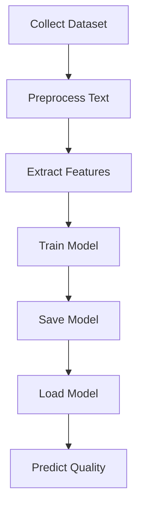

# AI-Based Writing Quality Checker using Machine Learning and NLP

<p align="center">
  
  
  
  
</p>

<p align="center">
An intelligent machine learning system that automatically evaluates writing quality using Natural Language Processing and predictive analytics.
</p>

---

# Live Deployment

[[Live Demo](https://ai-based-writing-quality-checking-f.vercel.app/)]

---

# Abstract

Writing quality assessment plays a critical role in education, recruitment, and professional communication. Traditional writing evaluation methods depend on manual review, which is time-consuming, subjective, and inconsistent.

This project presents an AI-based writing quality checking system that uses Machine Learning and Natural Language Processing techniques to automatically evaluate written content. The system analyzes text based on linguistic patterns, extracts relevant features, and predicts writing quality scores.

The project provides an automated solution for writing evaluation while reducing manual effort and improving consistency.

---

# 1. Introduction

Evaluating written content manually requires time, expertise, and consistency. Educational institutions and organizations often face challenges when assessing large volumes of written submissions.

This project automates writing quality analysis using Machine Learning and NLP techniques. The system analyzes writing structure, grammar-related features, vocabulary complexity, readability, and linguistic patterns to predict overall writing quality.

Objectives:

* Automate writing evaluation
* Reduce manual assessment time
* Improve evaluation consistency
* Provide scalable assessment solution
* Use NLP for intelligent text analysis

---

## Project Workflow


---

# 2. Literature Review

Traditional writing assessment methods depend on:

* Manual evaluation by teachers
* Grammar correction systems
* Rule-based language processing systems

Limitations:

* Subjective scoring
* High time consumption
* Human inconsistency
* Difficult scalability

Existing NLP systems use:

* TF-IDF vectorization
* Readability scoring algorithms
* Sentiment and syntax analysis
* Traditional supervised learning models

Machine learning models improve consistency and allow large-scale automated assessment.

---

## Comparison with Existing Systems

| Feature          | Manual Evaluation | Rule-Based Systems | Proposed System |
| ---------------- | ----------------- | ------------------ | --------------- |
| Human Dependency | High              | Medium             | No              |
| Scalability      | Low               | Medium             | High            |
| Consistency      | Medium            | Medium             | High            |
| Automation       | Low               | Medium             | High            |
| Processing Speed | Slow              | Moderate           | Fast            |

### Why This Project Performs Better

* Fully automated text evaluation
* Faster processing time
* Reduced human subjectivity
* Scalable for educational systems
* Machine learning driven prediction

---

# 3. Methodology

The project follows the following process.

### Data Collection

Writing samples collected and labeled according to quality metrics.

### Text Preprocessing

Raw text is cleaned and normalized.

### Feature Extraction

Important text features are extracted using NLP techniques.

### Model Training

Machine learning model is trained on processed writing samples.

### Prediction

Input text is evaluated and writing quality is predicted.

---

## System Architecture

```text
Input Text
      │
      ▼
Text Cleaning
      │
      ▼
Tokenization
      │
      ▼
Feature Extraction
      │
      ▼
Machine Learning Model
      │
      ▼
Prediction Engine
      │
      ▼
Writing Quality Score
```

---

# 4. Implementation

Technologies Used:

* Python
* Scikit-learn
* Natural Language Processing
* Pandas
* NumPy
* Pickle Model Storage
* Flask

Modules:

* Text Preprocessing Module
* Feature Extraction Module
* Prediction Engine
* Model Training Notebook

---

## Implementation Pipeline



---

# 5. Results

The system successfully performs:

* Text preprocessing
* Feature extraction
* Writing quality prediction
* Automated scoring

Benefits:

* Faster evaluation process
* Consistent scoring
* Scalable assessment system
* Reduced manual review effort

---

# 6. Limitations

Current limitations include:

* Limited training dataset size
* Cannot fully understand writing creativity
* Domain-specific writing may affect prediction
* Context understanding is limited

---

# 7. Future Scope

Possible future improvements:

* Deep learning based language models
* Grammar correction integration
* Essay scoring system
* Multi-language writing evaluation
* Real-time feedback generation
* Integration with educational platforms

---

## Future Expansion Architecture


---

# 8. Conclusion

This project successfully developed an AI-based writing quality checker using Machine Learning and Natural Language Processing.

The system automates writing evaluation, reduces manual effort, improves scoring consistency, and demonstrates how artificial intelligence can improve large-scale writing assessment systems.

---

# 9. References

1. Scikit-learn Documentation
2. Natural Language Toolkit Documentation
3. NLP Research Papers
4. Machine Learning Classification Research Papers
5. Automated Essay Scoring Research Papers

---


